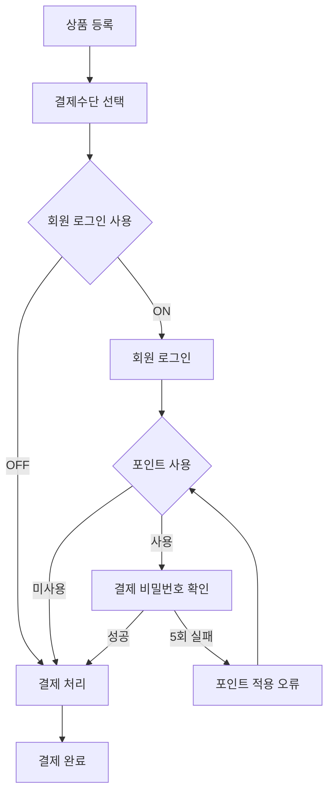

# Tomato Kiosk UI Prototype

토마토마트 셀프계산대의 전체 화면과 결제 흐름을 브라우저에서 시연하기 위한 정적 웹 프로토타입입니다.

Figma의 **`04_전체 화면 및 플로우`** 페이지를 구현 기준으로 사용하며, 상품 등록부터 회원 로그인, 포인트 사용, 결제 승인, 오류 처리, 결제 완료까지의 주요 흐름을 확인할 수 있습니다.

## 프로젝트 링크

- [Figma 기획서](https://www.figma.com/design/HAlzNgQMRILQRsf6UAgttm/%EC%85%80%ED%94%84%ED%82%A4%EC%98%A4%EC%8A%A4%ED%81%AC-UI-%EA%B0%9C%EC%84%A0%EC%95%88?node-id=1-5&p=f)
- [GitHub 저장소](https://github.com/star0301/kioskUI/)
- [GitHub Pages](https://star0301.github.io/kioskUI/)

## 현재 구현 범위

- 1080 × 1920 세로형 키오스크 화면
- 상품 바코드 스캔과 상품 직접 선택
- 카테고리 이동과 상품 페이지네이션
- 장바구니 수량 변경, 상품 삭제, 전체 취소
- 행사 할인과 결제금액 실시간 계산
- 봉투 선택 및 장바구니 추가
- APP 회원 바코드 로그인
- 휴대폰 회원 조회 및 신규 회원가입
- 브라우저 저장소를 이용한 가입 회원 중복 확인
- 회원 포인트 조회, 전액 사용, 직접 입력
- 포인트 결제 비밀번호 확인 및 5회 오류 처리
- 신용카드, 간편결제, 현금결제 시연
- 결제 승인 실패, 상품 오류, 타임아웃 등 예외 화면
- 포인트 적립·사용 내역 조회
- 셀프계산대 운영 옵션 변경

헤더의 `포인트 조회`에서 회원 인증에 성공하면 포인트 사용 화면이 아니라 `포인트 적립·사용 내역`으로 이동합니다. 결제수단 선택 후 진행하는 회원 로그인은 포인트 사용 화면으로 이동합니다.

이미 로그인된 회원이 상품을 담고 결제수단을 선택한 뒤 포인트 화면에서 `뒤로`를 누르면 로그인 화면이 아니라 장바구니·상품 선택 화면으로 돌아갑니다.

## 실행 방법

별도의 빌드 과정이나 패키지 설치가 필요하지 않습니다.

저장소를 받은 뒤 프로젝트 루트에서 정적 서버를 실행합니다.

```powershell
cd C:\dev\kioskUI
py -m http.server 8080
```

브라우저에서 아래 주소로 접속합니다.

```text
http://localhost:8080
```

`index.html`을 직접 열 수도 있지만, 브라우저 동작을 일정하게 확인하려면 정적 서버 사용을 권장합니다.

## 권장 시연 순서

1. 상품 카드를 누르거나 바코드를 스캔해 상품을 담습니다.
2. 필요하면 `봉투 구매`에서 봉투를 선택합니다.
3. 신용카드, 간편결제 또는 현금결제를 선택합니다.
4. 회원 혜택 화면에서 APP 바코드 또는 휴대폰 번호로 로그인합니다.
5. 포인트를 사용하지 않거나, 전액 사용 또는 직접 입력을 선택합니다.
6. 포인트를 사용하면 결제 비밀번호를 입력합니다.
7. 결제 승인과 완료 또는 오류 화면을 확인합니다.



## 시연용 회원 정보

| 구분 | 로그인 값 | 보유 포인트 | 결제 비밀번호 |
|---|---:|---:|---:|
| APP 회원 | `20250708000115` | `5,000P` | `1234` |
| 휴대폰 회원 | `010-1245-2534` | `2,000P` | `1234` |
| 휴대폰 회원 | `010-1111-1111` | `3,000P` | `1234` |
| 포인트 없는 회원 | `010-0000-0000` | `0P` | `1234` |

APP 회원 번호는 회원 로그인 화면에서 물리 바코드 스캐너로 입력할 수 있습니다. 휴대폰 회원은 화면의 숫자 키패드로 조회합니다.

신규 휴대폰 회원은 가입 과정에서 숫자 4자리 결제 비밀번호를 설정합니다. 가입 정보는 해당 브라우저에 저장되며, 같은 번호로 다시 가입하면 중복 회원으로 처리됩니다.

> 이 저장 방식은 시연 전용입니다. 실제 서비스에서는 결제 비밀번호를 브라우저에 평문으로 저장하지 말고 서버에서 암호화 및 검증해야 합니다.

## 바코드 스캔

물리 바코드 스캐너가 키보드처럼 숫자를 입력하고 `Enter`를 전송하는 방식을 기준으로 구현되어 있습니다. 기본 화면에서는 숨겨진 입력창이 스캐너 입력을 받습니다.

| 바코드 | 등록 상품 | 예상 결과 |
|---|---|---|
| `8801223100209` | 초정탄산수 플레인 330ml | 장바구니 추가 |
| 등록되지 않은 번호 | 없음 | 미등록 상품 안내 모달 |

APP 로그인, 간편결제, 연령 확인 화면에서는 입력된 바코드를 각 화면의 용도에 맞게 처리합니다.

## 포인트 정책

| 항목 | 현재 설정 |
|---|---:|
| 최소 사용 포인트 | `1,000P` |
| 사용 단위 | `10P` |
| 신규가입 축하 포인트 | `2,000P` |
| 기본 적립률 | 결제금액의 `1%` |
| 결제 완료 자동 초기화 | `8초` |

포인트 직접 입력값이 최소 사용 포인트보다 작거나 10P 단위가 아니면 오류 화면을 표시합니다. 전액 사용과 직접 입력 모두 결제 비밀번호를 확인한 뒤 포인트 적용 화면으로 돌아오며, 사용자가 `적용하고 결제 계속`을 눌러야 결제로 진행합니다.

결제 비밀번호를 연속 5회 잘못 입력하면 `포인트를 적용할 수 없습니다` 안내가 나타납니다. 안내를 닫으면 적용 포인트를 해제하고 포인트 선택 화면으로 돌아갑니다.

## 결제 시연 동작

| 결제수단 | 시연 결과 |
|---|---|
| 신용카드 | 카드 안내 → VAN 승인 진행 → 결제 완료 |
| 간편결제 | 바코드 스캔 → VAN 승인 진행 → 최초 승인 오류 |
| 현금결제 | 현금 투입 안내 → 결제 완료 |

결제 화면은 실제 VAN, 카드 리더기, 현금 장치와 통신하지 않습니다. 화면 전이와 오류 대응을 검토하기 위한 타이머 기반 시뮬레이션입니다.

## 운영 옵션

상단 매장명 영역을 누르면 시연 중 운영 옵션을 바꿀 수 있습니다. 변경값은 브라우저 `localStorage`에 저장됩니다.

| 옵션 | 시연 기본값 | 동작 |
|---|:---:|---|
| 셀프계산대 회원 로그인 사용 | ON | OFF이면 회원 혜택·로그인·포인트 화면을 건너뛰고 결제로 이동 |
| 상품직접선택 사용 | ON | OFF이면 상품 직접 선택 영역을 숨기고 장바구니를 전체 폭으로 확장 |
| 셀프계산대 사용 | ON | 키오스크 모드 사용 여부 |
| 신규회원 가입 금지 | OFF | ON이면 신규가입 관련 UI를 숨김 |
| 고객적립 사용 | ON | OFF이면 결제 완료 시 포인트를 적립하지 않음 |
| 현금결제 사용 | ON | OFF이면 현금결제 선택을 비활성화 |
| 연령제한상품 판매불가 | OFF | ON이면 연령제한 상품을 차단하고, OFF이면 관리자 승인으로 진행 |
| 봉투판매 사용 | ON | OFF이면 봉투 구매를 비활성화 |
| 타임아웃 | `0초` | 0은 미사용, 설정 시 만료 10초 전에 경고 표시 |

실제 매장용 기본값과 전체 기능을 보여주기 위한 시연 기본값은 `app.js`에 각각 `OPERATION_DEFAULTS`, `DEMO_DEFAULTS`로 분리되어 있습니다.

## 화면 구성 기준

- 기준 캔버스 폭: `1080px`
- 최대 높이: `1920px`
- 유연 높이 구간: `1720px` ~ `1920px`
- 브라우저 높이가 1720px보다 작으면 1720px 캔버스를 유지하고 세로 스크롤 사용
- 주요 레이아웃: CSS Grid 및 Flexbox
- 모달 컨테이너: 고정 높이 대신 내부 콘텐츠에 따라 확장

## 파일 구성

```text
kioskUI/
├─ index.html       # 키오스크 기본 화면과 DOM 구조
├─ styles.css       # 1080 × 1920 레이아웃, 컴포넌트, 모달 스타일
├─ app.js           # 데이터, 상태, 장바구니, 스캔, 화면 전이
├─ modals.js        # Figma 기준 모달 화면 정의와 세부 전이
├─ assets/
│  └─ img/          # ERP 상품 ID와 연결할 상품 이미지
└─ README.md        # 프로젝트 안내 문서
```

상품 이미지는 `assets/img/{상품ID}.jpg`, `.png`, `.webp` 순서로 탐색합니다. 이미지가 없어도 카드 구조는 유지됩니다.

## 브라우저 저장 데이터

| localStorage 키 | 내용 |
|---|---|
| `tomato-kiosk-options` | 셀프계산대 운영 옵션 |
| `tomato-kiosk-phone-members` | 시연 중 가입한 휴대폰 회원 |

시연 데이터를 완전히 초기화하려면 브라우저 개발자 도구에서 위 키를 삭제하거나 사이트 데이터를 초기화합니다.

## GitHub Pages 배포

GitHub 저장소의 `Settings → Pages`에서 `main` 브랜치의 루트 폴더가 배포 원본으로 설정되어 있다면 `main`에 푸시할 때 자동으로 다시 배포됩니다.

README만 추가하는 경우:

```bash
git add README.md
git commit -m "docs: add kiosk prototype README"
git push origin main
```

배포 화면이 이전 버전으로 보이면 먼저 `Ctrl + F5`로 강력 새로고침합니다. HTML에서 CSS와 JavaScript 파일 뒤에 붙은 버전 쿼리도 캐시 갱신에 사용됩니다.

## Figma와 코드의 관리 원칙

- 화면과 전이의 기준은 Figma `04_전체 화면 및 플로우` 페이지입니다.
- 공통 버튼, 입력창, 배지, 알림 요소는 Figma `05_컴포넌트`의 표현을 우선합니다.
- 모달 외곽 높이는 수치에 고정하지 않고 내부 요소와 여백에 맞춰 확장합니다.
- 화면을 변경할 때 Figma의 상태명, 코드의 모달 키, 이전·다음 화면을 함께 확인합니다.
- 운영 정책값을 변경하면 `STORE`, `OPERATION_DEFAULTS`, `DEMO_DEFAULTS`와 이 문서를 같이 갱신합니다.

## 프로토타입 범위와 다음 단계

현재 버전은 UI·UX 검증과 현장 시연을 위한 프론트엔드 프로토타입입니다. ERP, 회원 서버, VAN, 영수증 프린터, 현금 장치와의 실제 연동은 포함하지 않습니다.

운영 적용 전에는 다음 작업이 필요합니다.

- 회원·포인트·결제 API 연동
- 결제 비밀번호의 서버 측 보안 검증
- 실제 장치별 바코드 입력 종료 문자 및 입력 속도 점검
- VAN 응답 코드와 재시도 정책 연동
- 네트워크 장애 및 장치 오류 복구 처리
- 접근성, 포커스 이동, 터치 영역 현장 검증
- 실제 상품·행사·이미지 데이터 연동

---

현재 프로토타입 기준 버전: **v4.3.4**
